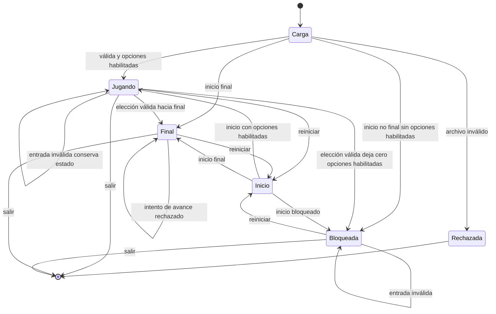

# M05 estados

```mermaid
stateDiagram-v2
    [*] --> Carga
    Carga --> Rechazada: archivo inválido
    Rechazada --> [*]
    Carga --> Jugando: válida y opciones habilitadas
    Carga --> Final: inicio final
    Carga --> Bloqueada: inicio no final sin opciones habilitadas
    Jugando --> Jugando: elección válida hacia escena habilitada
    Jugando --> Final: elección válida hacia final
    Jugando --> Bloqueada: elección válida deja cero opciones habilitadas
    Jugando --> Jugando: entrada inválida conserva estado
    Bloqueada --> Bloqueada: entrada inválida
    Final --> Final: intento de avance rechazado
    Jugando --> Inicio: reiniciar
    Final --> Inicio: reiniciar
    Bloqueada --> Inicio: reiniciar
    state Inicio <<choice>>
    Inicio --> Jugando: inicio con opciones habilitadas
    Inicio --> Final: inicio final
    Inicio --> Bloqueada: inicio bloqueado
    Jugando --> [*]: salir
    Final --> [*]: salir
    Bloqueada --> [*]: salir
```
